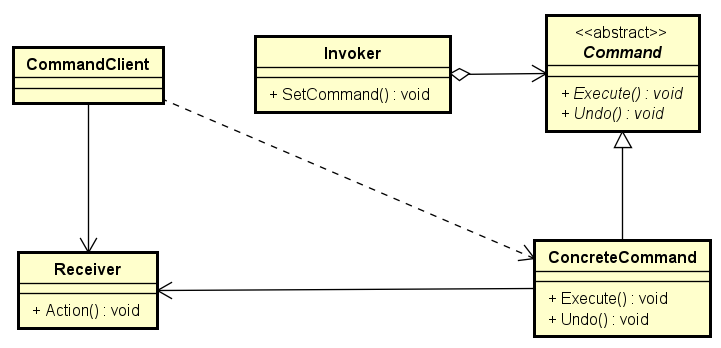
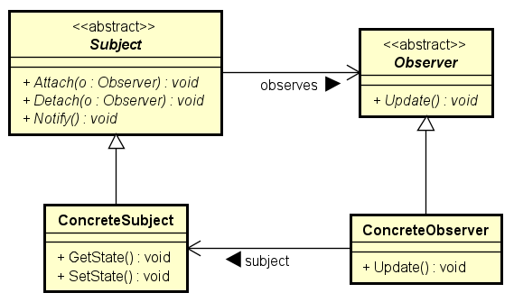
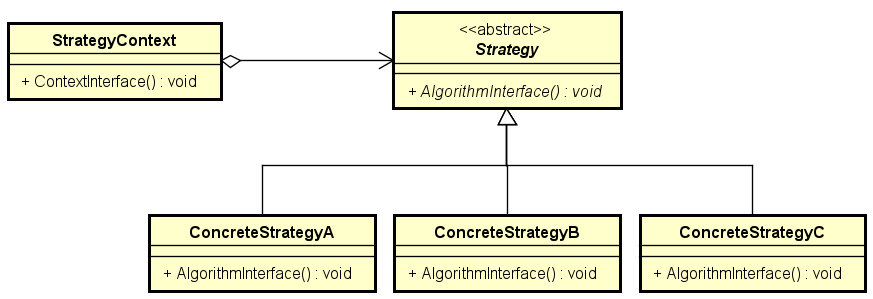
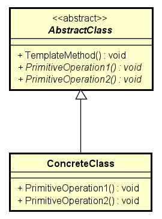

# Behavioral Design Patterns

In software engineering, behavioral design patterns are design patterns that
identify common communication patterns between objects and realize these
patterns. By doing so, these patterns increase flexibility in carrying out
this communication.

Behavioral patterns influence how state and behavior flow through a system.
By optimizing how state and behavior are transferred and modified, you can
simplify, optimize, and increase the maintainability of an application.

## Command Pattern

The Command pattern encapsulates a request in an object, which enables you to
store the command, pass the command to a method, and return the command like any
other object.

### Benefits of Command Pattern

* Separates the object that invokes the operation from the one that knows how to
perform it.
* It's easy to add new commands, because you don't have to change existing
classes.

### When to Use Command Pattern

* You want to parameterize objects by an action to perform.
* You specify, queue, and execute requests at different times.
* You must support undo, logging, or transactions

## Observer Pattern

The Observer pattern provides a way for a component to flexibly broadcast
messages to interested receivers. It defines a one-to-many dependency between
objects so that when one object changes state, all its dependents are notified
and updated automatically.

### Benefits of Observer Pattern

* Abstract coupling between subject and observer.
* Support for broadcast communication.

### When to Use Observer Pattern

* A change to one object requires changing the other object and you do not know
how many objects need to change. An object should be able to notify other
objects without making assumptions about the identity of those objects.

## Strategy Pattern

The intent of the Strategy Pattern is to define a family of algorithms,
encapsulate each algorithm, and make them interchangeable. The Strategy Pattern
lets the algorithm vary independently from clients that use it. In addition the
pattern, defines a group of classes that represent a set of possible behaviors.
These behaviors can then be used in an application to change its functionality.

### Benefits of Strategy Pattern

* An alternative to subclassing.
* Defines each behavior in its own class, which eliminates conditional
statements.
* Easier to extend a model to incorporate new behaviors without recoding the
application.

### When to Use Strategy Pattern

* Many related classes differ only in their behavior.
* You need different variants of an algorithm.
* An algorithm uses data unknown to clients.

## Template Method Pattern

The Template Method pattern provides a method that allows subclasses to override
parts of the method without rewriting it. Define the skeleton of an algorithm in
an operation, deferring some steps to subclasses. Template method lets
subclasses redefine certain steps of an algorithm without changing the structure
of the algorithm.

### Benefits of Template Method Pattern

* Fundamental technique for reusing code.

### When to Use Template Method Pattern

* You want to implement the invariant parts of an algorithm once and use
subclasses to implement the behavior that can vary.
* When common behavior among subclasses should be factored and localized in a
common class to avoid code duplication.

> Available at:
[https://www.gofpatterns.com/behavioral/index.php](https://www.gofpatterns.com/behavioral/index.php)
