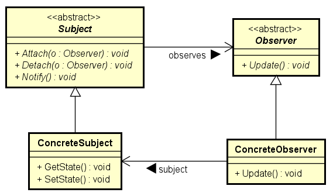

# Padrões de Projeto Comportamentais

Em engenharia de software, os padrões de projeto comportamentais são os que
identificam padrões de comunicação em comum entre objetos e implementam esses
padrões. Fazendo isso, eles aumentam a flexibilidade ao executar essa
comunicação.

Os padrões comportamentais influenciam como estados e comportamentos fluem
por um sistema. Otimizando como os estados e comportamentos são transferidos
e modificados, você pode simplificar, otimizar e aumentar a mantenibilidade
da sua aplicação.

## Padrão Command

O padrão Command encapsula uma requisição em um objeto, o que permite armazenar
o comando, passá-lo a um método e retornar o comando como qualquer outro objeto.

### Benefícios do Padrão Command

* Separa o objeto que invoca a operação daquele que sabe como executá-la.
* É fácil adicionar novos comandos, porque você não tem que alterar sa classes
existentes.

### Quando Usar o Padrão Command

* Você quer parametrizar os objetos pela ação que eles executam.
* Você especifica, enfileira e executa solicitações em momentos diferentes.
* Você precisa dar suporte a operações reversíveis, registro de logs e
transações.

## Padrão Observer

O padrão Observer provê uma maneira de um componente transmitir mensagens para
receptores interessados de uma maneira flexível. Ele define uma dependência
um-para-muitos entre os objetos, assim, quando um objeto muda de estado, todos
os seus dependentes são notificados e atualizados automaticamente.

### Benefícios do Padrão Observer

* Baixo acoplamento entre sujeito e observador.
* Suporte para comunicação difundida (broadcast).

### Quando usar o Padrão Observer

* Uma mudança em um objeto requer alterações em outros objetos e você não
sabe quantos objetos precisam ser modificados. Um objeto deveria ser capaz de
notificar outros objetos sem fazer suposições sobre a identidade desses
objetos.

## Padrão Strategy

O objetivo do Padrão Strategy é definir uma família de algoritmos, encapsular
cada algoritmo e torná-los intercambiáveis. O Padrão Strategy permite que o
algoritmo varie independentemente dos clientes que o usam. Além disso, o padrão
define um grupo de classes que representam um conjunto de comportamentos
possíveis. Os comportamentos podem então ser usados em uma aplicação para
alterar suas funcionalidades.

### Benefícios do Padrão Strategy

* Uma alternativa à herança de classe.
* Define cada comportamento em sua própria classe, o que elimina declarações
condicionais.
* Mais fácil de extender um modelo para incorporar novos comportamentos sem
alterar o código da aplicação.

### Quando Usar o Padrão Strategy

* Muitas classes relacionadas diferem entre si apenas em seus comportamentos.
* Você precisa de diferentes variações de um algoritmo.
* Um algoritmo usa dados desconhecidos pelos clientes.

> Disponível em:
[https://www.gofpatterns.com/behavioral/index.php](https://www.gofpatterns.com/behavioral/index.php) (tradução livre)
