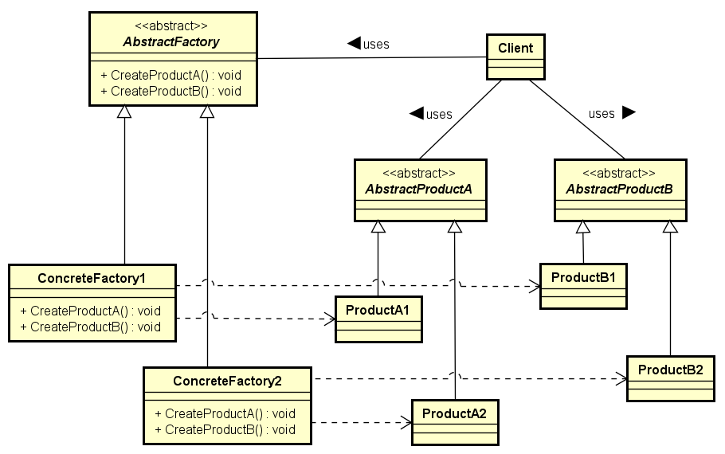

# Creational Design Patterns

In software engineering, creational design patterns are design patterns that
deal with object creation mechanisms, trying to create objects in a manner
suitable to the situation. The basic form of object creation could result in
design problems or added complexity to the design. Creational design patterns
solve this problem by somehow controlling this object creation.

Creational design patterns are composed of two dominant ideas.

* One is encapsulating knowledge about which concrete classes the system use.
* Another is hiding how instances of these concrete classes are created and
combined.

## Abstract Factory

This pattern provides an interface for creating families of related or dependent
objects without specifying their concrete classes.
Given a set of related abstract classes, the Abstract Factory pattern provides a
way to create instances of those abstract classes from a matched set of concerte
subclasses.
The "Abstract Factory" pattern provides an abstract class that determines the
appropriate concrete class to instantiate to create a set of concrete products
that implement a standard interface. The client interacts only with the product
interfaces and the Abstract Factory class. The client never knows about the
concrete construction classes provided by this pattern. The Abstract Factory
pattern is similar to the Factory Method pattern, except it creates families of
related objects.

### Benefits of Abstract Factory

* Isolates concrete classes.
* Makes exchanging product families easy.
* Promotes consistency among products.

### When to Use Abstract Factory

* The system should be independent of how its products are created, composed,
and represented.
* The system should be configured with one of multiple families of products a)
MS Windows or b) Apple Macintosh
* The family of related product objects is designed to be used together, and you
must enforce this constraint. This is the key point of the pattern, otherwise
you could use a Factory Pattern.

## Factory Method

The Factory Method pattern defines an interface for creating an object, but lets
the subclasses decide which class to instantiate. The Factory method lets a
class defer instantiation to subclasses, which is useful for constructing
individual objects for a specific purpose without the requestor knowing the
specific class being instantiated. This allows you to introduce new classes
without modifying the code because the new class implements only the interface
so it can be used by the client. You create a new factory class to create the
new class and the factory class implements the factory interface.

### Benefits of Factory Method

* Eliminates the need to bind application classes into your code. The code deals
only with the interface, so you can work with any classes that implement that
interface.
* Enables the subclasses to provide an extended version of an object, because
creating an object inside a class is more flexible than creating the object
directly in the client.

### When To Use Factory Method

* A class cannot anticipate the class of objects it must create.
* A class wants its subclasses to specify the objects it creates.
* Classes delegate responsibility to one of several helper subclasses, and you
want to localize the knowledge of which helper subclass is the delegate.

> Available at:
[https://www.gofpatterns.com/creational/index.php](https://www.gofpatterns.com/creational/index.php)
