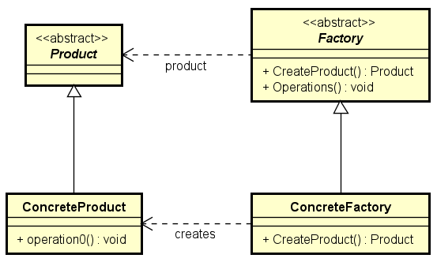
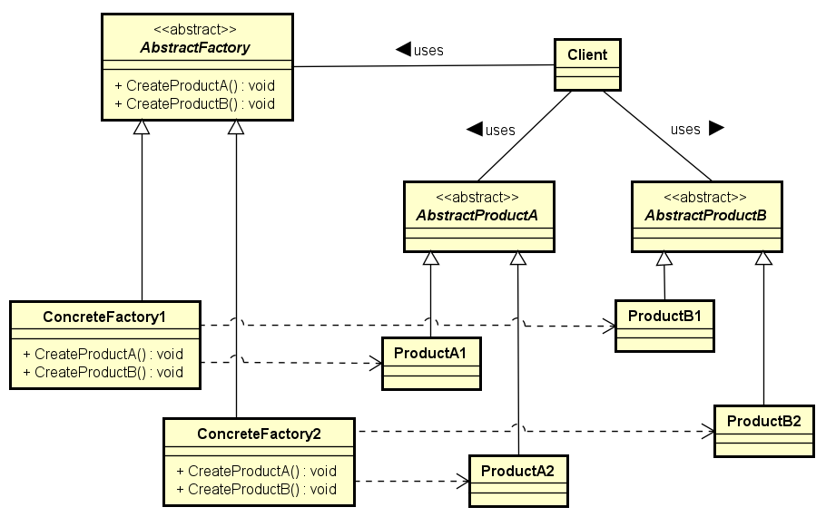

# Padrões de Projeto Criacionais

Em engenharia de software, padrões de projeto criacionais são os que lidam com
mecanismos de criação dos objetos, tentando criá-los de uma maneira adaptável
à situação. A forma básica de criação de um objeto pode resultar em problemas
de design ou adicionar complexidade extra. Os padrões criacionais resolvem
esse problema de certa forma controlando a criação do objeto.

Os padrões de projeto criacionais são compostos de duas ideias dominantes.

* Uma é encapsular o conhecimento sobre que classes concretas o sistema usa.
* A outra é esconder como as instâncias dessas classes concretas são criadas
e combinadas.

## Factory Method

O padrão Factory Method define uma interface para criação de um objeto, mas
deixa as subclasses decidirem que classe instanciar. O Factory Method deixa a
classe delegar a instanciação às subclasses, o que é útil para construir
objetos individuais para propósitos específicos sem que o cliente conheça as
classes específicas sendo instanciadas. Isso permite introduzir novas classes
sem modificar o código porque as novas classes implementam apenas a interface
para que possa ser utilizada pelo cliente. Você cria uma classe fábrica para
criar a nova classe e a fábrica implementa a interface fábrica.

### Benefícios do Factory Method

* Elimina a necessidade de vincular as classes da aplicação no seu código. O
código lida somente com a interface, assim você pode trabalhar com qualquer
classe que implemente essa interface.
* Possibilita que as subclasses forneçam uma versão estendida de um objeto,
porque criar um objeto dentro de uma classe é mais flexível do que criar o
objeto diretamente no cliente.

### Quando Usar Factory Method

* Uma classe não pode antecipar a classe dos objetos que deve criar.
* Uma classe quer que suas subclasses especifiquem os objetos que ela cria.
* As classes delegam responsabilidade para uma de várias classes auxiliares,
e você quer restringir o conhecimento de qual classe auxiliar recebe a
delegação.

## Abstract Factory

Este padrão fornece uma interface para criar famílias de objetos relacionados
ou dependentes sem especificar suas classes concretas.
Dado um conjunto de classes abstratas, o padrão Abstract Factory fornece uma
maneira de criar instâncias dessas classes abstratas a partir de um conjunto
de subclasses concretas correspondente.
O padrão "Abstract Factory" fornece uma classe abstrata que determina a classe
concreta apropriada de instanciação para criar um conjunto de produtos concretos
que implementam a interface padrão. O cliente interage somente com as interfaces
do produto e a classe Abstract Factory. O cliente nunca sabe sobre a construção
concreta das classes fornecidas pelo padrão. O Abstract Factory é similar ao
Factory Method, exceto pelo fato de criar famílias de objetos relacionados.

### Benefícios do Abstract Factory

* Isola as classes concretas.
* Torna fácil o intercâmbio de famílias de produtos.
* Promove a consistência entre produtos.

### Quando usar Abstract Factory

* O sistema deveria ser independente de como seus produtos são criados,
compostos e representados.
* O sistema deveria ser configurado com uma de múltiplas famílias de produtos
a) MS Windows ou b) Apple Macintosh
* A família de produtos relacionados é desenhada para ser usada em conjunto, e
você precisa garantir essa restrição. Este é o ponto chave do padrão, do
contrário você poderia usar um Factory Pattern.

> Disponível em:
[https://www.gofpatterns.com/creational/index.php](https://www.gofpatterns.com/creational/index.php) (tradução livre)
