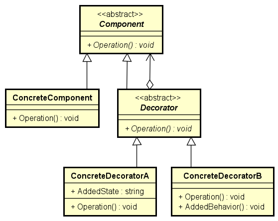

# Structural Design Patterns

Structural design patterns are design patterns that ease the design by
identifying a simple way to realize relationships between entities. Structural
patterns are for tying together existing function.

## Adapter Pattern

The Adapter pattern acts as an intermediary between two classes, converting the
interface of one class so that it can be used with the other. This enables
classes with incompatible interfaces to work together. The Adapter pattern
implements an interface known to its clients and provides access to an instance
of a class not known to its clients. An adapter object provides the
functionality of an interface without having to know the class used to implement
that interface.

### Benefits of Adapter Pattern

* Allows two or more incompatible objects to communicate and interact
* Improves reusability of older functionality

### When to Use Adapter Pattern

* You want to use an existing class, and its interface does not match the
interface you need.
* You want to create a reusable class that cooperates with unrelated or
unforeseen classes, that is, classes that do not necessarily have compatible
interfaces.
* You want to use an object in an environment that expects an interface that is
different from the object's interface.
* Interface translation among multiple sources must occur.

## Decorator Pattern

The Decorator pattern enables you to add or remove object functionality without
changing the external appearance or function of the object. It changes the
functionality of an object in a way that is transparent to its clients by using
an instance of a subclass of the original class that delegates operations to the
original object. The Decorator pattern attaches additional responsibilities to
an object dynamically to provide a flexible alternative to changing object
functionality without using static inheritance.

### Benefits of Decorator Pattern

* More flexibility than static inheritance.
* Avoids feature-laden classes high up in the hierarchy.
* Simplifies coding because you write a series of classes, each targeted at a
specific part of the functionality, rather than coding all behavior into the
object.
* Enhances the object's extensibility because you make changes by coding new
classes.

### When To Use Decorator Pattern

* You want to add responsibilities to individual objects dynamically and
transparently, that is without affecting other objects.
* You want to add responsibilities to the object that you want to change in the
future.
* When extension by static sub-classing is impractical.

> Available at:
[https://www.gofpatterns.com/structural-patterns/index.php](https://www.gofpatterns.com/structural-patterns/index.php)
