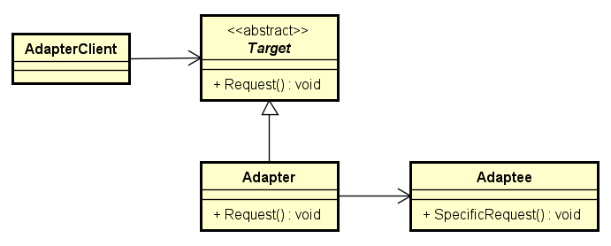
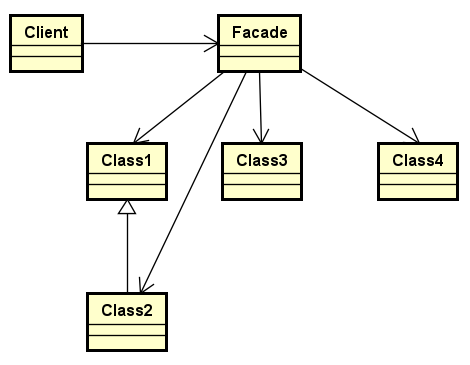

# Padrões de Projeto Estruturais

Os Padrões de Projeto Estruturais são padrões de projeto que facilitam o design
identificando uma maneira simples de realizar relacionamentos entre entidades.
Padrões estruturais servem para vincular funções existentes.

## Padrão Adapter

O padrão Adapter atua como um intermediário entre duas classes, convertendo a
interface de uma classe de forma que possa ser usada pela outra. Isso habilita
classes com interfaces incompatíveis a trabalharem juntas. O padrão Adapter
implementa uma classe conhecida pelos seus clientes e fornece acesso a uma
instância de uma classe não conhecida por eles. Um objeto adaptador fornece a
funcionalidade de uma interface sem ter que conhecer as classes usadas para
implementar essa interface.

### Vantagens do Padrão Adapter

* Permite que dois ou mais objetos incompatíveis se comuniquem e interajam.
* Melhora a reusabilidade de funcionalidades antigas.

### Quando Usar o Padrão Adapter

* Você quer usar uma classe existente e suas interfaces não combinam com a
interface que você precisa.
* Você quer criar uma classe reutilizável que coopera com classes não
relacionadas ou não previstas, ou seja, classes que não necessariamente têm
interfaces compatíveis.
* Você quer usar um objeto em um ambiente que espera uma interface diferente da
interface do objeto.
* A tradução da interface entre múltiplas fontes deve ocorre.

## Padrão Decorator

O padrão Decorator habilita a adição ou remoção de funcionalidades do objeto
sem alterar a aparência externa ou função do objeto. Ele altera a funcionalidade
do objeto de uma forma que seja transparente aos seus clientes usando uma
instância de uma subclasse da classe original que delega operações ao objeto
original. O Padrão Decorator incluir responsabilidades adicionais a um objeto
dinamicamente para prover uma alternativa flexível para alterar funcionalidades
do objeto sem usar herança estática.

### Vantagens do Padrão Decorator

* Mais flexibilidade do que a herança estática.
* Evita classes com características de alto nível na hierarquia.
* Simplifica o código porque você escreve uma série de classes, cada uma
objetivando uma parte específica da funcionalidade, ao invés de codificar todos
os comportamentos dentro do objeto.
* Garante a extensibilidade do objeto porque você altera o código com novas
classes.

### Quando Usar o Padrão Decorator

* Você quer adicionar responsabilidades a objetos individuais dinamicamente e de
forma transparente, ou seja, sem afetar outros objetos.
* Você quer adicionar responsabilidades ao objeto que você quer alterar no
futuro.
* Quando a extensão por sub-classes estáticas é impraticável.

## Padrão Facade

O padrão Facade fornece uma interface unificada para um grupo de interfaces em
um subsistema. Ele define uma interface de alto nível que torna o uso do
subsistema mais fácil porque você tem somente uma interface, que permite a um
objeto utilizá-la para se comunicar com o subsistema.

### Vantagens do Padrão Facade

* Fornece uma interface simples a um sistema complexo reduzindo as opções
fornecidas pelo sistema.
* Blinda os clientes dos componentes de subsistemas.
* Promove baixo acoplamento entre o subsistema e seus clientes.
* Reduz o acoplamento entre subsistemas se cada subsistema usar seu próprio
padrão Facade e outras partes do sistema usarem o padrão Facade para se
comunicarem com o subsistema.
* Traduz as requisições do cliente aos subsistemas que podem atendê-las.

### When To Use Facade Pattern

* Você quer fornecer uma interface simples a um sistema complexo.
* Há muitas dependências entre cliente e classes de implementação de uma
abstração.
* Você quer dividir seus subsistemas em camadas.

> Disponível em:
[https://www.gofpatterns.com/structural-patterns/index.php](https://www.gofpatterns.com/structural-patterns/index.php) (tradução livre)
